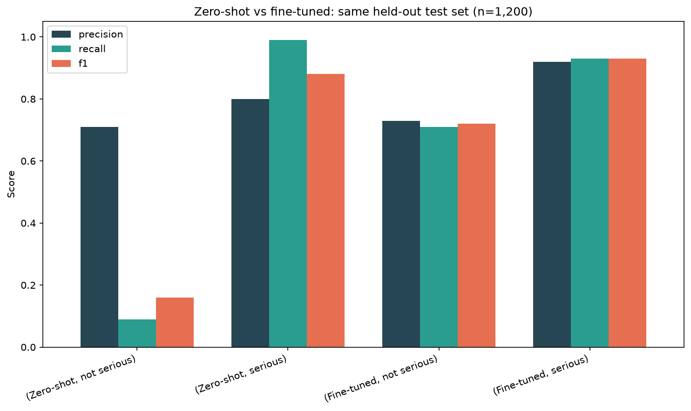

## Model Comparison: Zero-shot vs. Fine-tuned

Classifying whether a report is serious, from the reaction text alone.

**Model comparison takeaway:** A zero-shot classifier (no training on our
data) almost always predicted "serious," catching only 9% of true
non-serious reports. Fine-tuning a small model (distilbert) on our labeled
data, with class weighting to address the 78/22 imbalance, raised that to
71% recall on the minority class — at the cost of a small drop in "serious"
recall (99% → 93%) — for a net accuracy gain from 80% to 88%. Both models
were evaluated on the same held-out 1,200 reports the fine-tuned model never
trained on, so this is a fair comparison.
